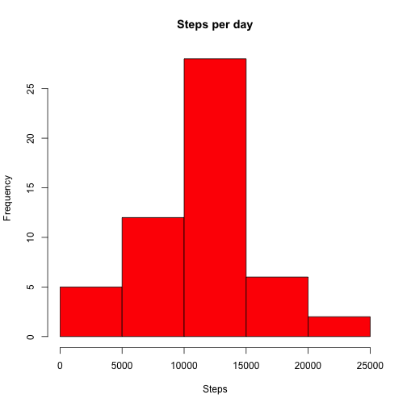
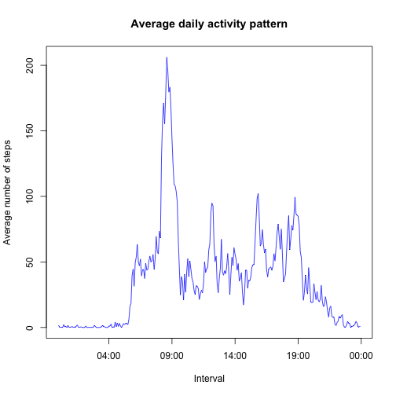
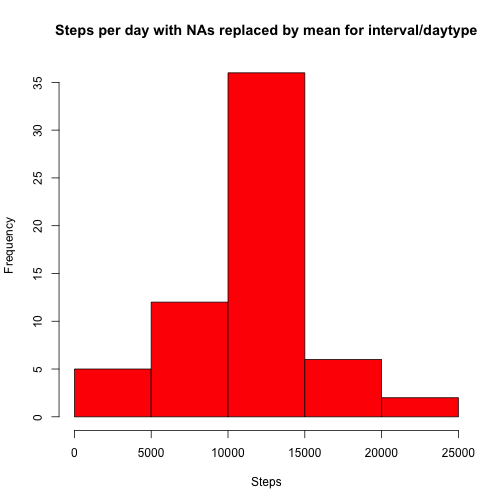
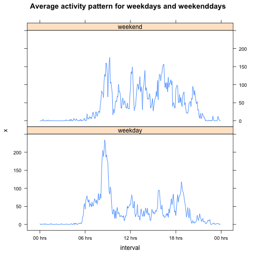

This report is created for peer assessment 1 of the Coursera Reproducibe Research course and analyses the number of steps per day. 

## Loading and preprocessing the data

The activity data is loaded and the following transformations are performed:

- Date is converted from character to Date format
- Interval data is transformed to a time variable. This is done for getting the correct scale when plotting
time series data. Specifically, when using an integer there is a gap between the data from say 08:55 and
09:00. This is resolved by converting to time format. 

```r
library(lubridate)
library(stringr)
unzip('activity.zip')
activity <- read.csv('activity.csv')
activity$date <- ymd(activity$date)
activity$interval <- paste(str_pad(activity$interval %/% 100, 2, pad="0"),
                               ":",
                               str_pad(activity$interval %% 100, 2, pad="0"), 
                               ":",
                               "00", sep = "")
activity$interval <- as.POSIXct(activity$interval, format="%H:%M:%S")
```

## What is mean total number of steps taken per day?

```r
stepsperday<- aggregate(activity$steps, by=list(date=activity$date), FUN=sum)
hist(stepsperday$x, col="red", main="Steps per day", xlab="Steps")
```

 

Mean and median of the number of steps taken per day:

```r
mean(stepsperday$x, na.rm=TRUE)
```

```
## [1] 10766.19
```

```r
median(stepsperday$x, na.rm=TRUE)
```

```
## [1] 10765
```

## What is the average daily activity pattern?
Number of steps throughout the day

```r
stepsperinterval <- aggregate(activity$steps, by=list(interval=activity$interval), FUN=function(x) {mean(x, na.rm=TRUE)})
plot(stepsperinterval$interval, stepsperinterval$x, type="l", col="blue", xlab="Interval", ylab="Average number of steps", main="Average daily activity pattern")
```

 

The interval with the highest number of steps is:

```r
format(stepsperinterval[which.max(stepsperinterval$x), "interval"], "%H:%M")
```

```
## [1] "08:35"
```

## Imputing missing values
A number of values are missing in the dataset. The number of rows with NAs is:

```r
dim(activity[!complete.cases(activity),])[1]
```

```
## [1] 2304
```

We will impute the missing values. This is done by taking the mean for that interval from the completed days. As we will compare later weekdays and weekends, for missing weekday values the weekday mean is used and for missing weekend values the weekend mean is used. 


```r
activity$daytype <- ifelse(weekdays(activity$date) %in% c("Saturday", "Sunday"), "weekend", "weekday")
activity$daytype <- as.factor(activity$daytype)
activity_imputed <- activity
for (x in which(is.na(activity_imputed$steps))) {
  activity_imputed[x, "steps"] <- mean(activity_imputed[activity_imputed$interval == activity[x, "interval"] & 
                                          activity_imputed$daytype == activity_imputed[x,"daytype"], 
                                          "steps"], na.rm=TRUE)
}
```


```r
stepsperday_i<- aggregate(activity_imputed$steps, by=list(date=activity_imputed$date), FUN=sum)
hist(stepsperday_i$x, col="red", main="Steps per day with NAs replaced by mean for interval/daytype", xlab="Steps")
```

 

Mean and median of the number of steps taken per day after imputing missing values:

```r
mean(stepsperday_i$x, na.rm=TRUE)
```

```
## [1] 10762.05
```

```r
median(stepsperday_i$x, na.rm=TRUE)
```

```
## [1] 10571
```

Imputing missing values has a slight impact on mean and median.  
On the mean, a minimal impact is expected as the mean of non-missing values is used to impute values. The slight difference is caused due to the fact that different values have been used for weekends and weekdays.  
The main impact is shown in the histogram. With data typically missing for an entire day, replacing the NAs with mean values causes the number of days in the central bucket to increase significantly. 

## Are there differences in activity patterns between weekdays and weekends?

A factor variable indicating weekday and weekend has already been introduced in the Imputing missing values section. 

The activity patterns differ between weekdays and weekends as shown below.


```r
library(lattice)
stepsperinterval_daytype <- aggregate(activity_imputed$steps, by=list(interval=activity_imputed$interval, daytype=activity$daytype), mean)

xyplot(data=stepsperinterval_daytype, x ~ interval | daytype, type="l", layout=c(1,2),
       scales = list(x = list(at= seq(as.POSIXct("00:00", format="%H:%M"), by="6 hour", length = 5),
                              labels=format(seq(as.POSIXct("00:00", format="%H:%M"), by="6 hour", length = 5), 
                                            "%H hrs"))
                     ), 
       main="Average activity pattern for weekdays and weekenddays")
```

 
